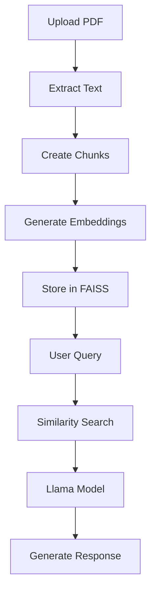

# 📚 RAG Application Development using Python

A Retrieval-Augmented Generation (RAG) application built using Python that allows users to chat with documents and summarize YouTube videos using AI. The project combines modern LLMs, semantic search, vector databases, and OCR capabilities to provide accurate and context-aware responses.

---

## 🚀 Features

- 📄 Upload and chat with PDF documents
- 🤖 Retrieval-Augmented Generation (RAG)
- 🧠 Uses Llama Model as the Large Language Model (LLM)
- 🔍 Semantic Search using Sentence Transformers
- 📦 FAISS Vector Database for fast similarity search
- ✂️ Automatic document chunking
- 🎥 Summarize YouTube videos using YouTube Transcript API
- 📊 Generate flowcharts using Mermaid
- 📝 OCR support using Tesseract OCR
- 💬 Maintains chat history
- ⚡ Fast and efficient document retrieval

---

## 🛠️ Tech Stack

| Technology | Purpose |
|------------|---------|
| Python | Backend Development |
| Streamlit | User Interface |
| LangChain | RAG Pipeline |
| Llama Model | Large Language Model |
| Hugging Face Sentence Transformers | Text Embeddings |
| FAISS | Vector Database |
| YouTube Transcript API | Video Transcript Extraction |
| Mermaid | Flowchart Generation |
| Tesseract OCR | Text Extraction from Images |
| PyMuPDF | PDF Processing |

---

## 📁 Project Structure

```text
RAG/
│
├── .venv/                         # Python virtual environment
│
├── data/                          # Uploaded documents
│   └── The Lion on Mars.pdf
│
├── faiss_store/                   # FAISS vector database
│   ├── faiss.index
│   └── metadata.pkl
│
├── src/                           # Core application modules
│   ├── __init__.py
│   ├── chat_history.py            # Chat history management
│   ├── csv_agent.py               # CSV querying agent
│   ├── data_loader.py             # Loads PDF, TXT, DOCX, CSV, etc.
│   ├── diagram_generator.py       # Mermaid flowchart generation
│   ├── embedding.py               # Embedding generation
│   ├── search.py                  # Similarity search logic
│   ├── vectorstore.py             # FAISS database operations
│   ├── youtube_chunker.py         # Chunk YouTube transcripts
│   ├── youtube_export.py          # Export YouTube summaries
│   ├── youtube_loader.py          # Load YouTube transcripts
│   └── youtube_notes.py           # AI-generated YouTube notes
│
├── .env                           # Environment variables
├── .gitignore
├── .python-version
├── app.py                         # Streamlit application
├── chat_history.json              # Stores conversation history
├── main.py                        # Application entry point
├── pyproject.toml                 # Project configuration
├── README.md
├── requirement.txt                # Python dependencies
├── tesseract-ocr-w64-setup-5.5...exe  # Tesseract OCR installer
└── uv.lock                        # uv dependency lock file
```

---

## ⚙️ Installation

### 1. Clone the Repository

```bash
git clone <repository-url>

cd RAG
```

---

### 2. Install Dependencies

Using **pip**

```bash
pip install -r requirement.txt
```

or using **uv**

```bash
uv pip install -r requirement.txt
```

---

### 3. Install Tesseract OCR

Download and install **Tesseract OCR**.

During installation, remember its installation path.

Example:

```
C:\Program Files\Tesseract-OCR\
```

If required, update the Tesseract path inside the project.

---

### 4. Configure Environment Variables

Create a `.env` file in the project root.

Example:

```env
GROQ_API_KEY=your_api_key
```

---

## ▶️ Run the Application

```bash
streamlit run app.py
```

or

```bash
python main.py
```

---

## 🔄 Workflow

```text
Upload PDF
      │
      ▼
Extract Text
      │
      ▼
Chunk Documents
      │
      ▼
Generate Embeddings
(Hugging Face Sentence Transformers)
      │
      ▼
Store Embeddings
(FAISS)
      │
      ▼
User Query
      │
      ▼
Similarity Search
      │
      ▼
Relevant Chunks
      │
      ▼
Llama Model
      │
      ▼
Generate Answer
```

---

## 🎥 YouTube Video Summarization

The application can summarize YouTube videos by:

- Accepting a YouTube video URL
- Extracting the transcript using YouTube Transcript API
- Sending the transcript to the Llama model
- Returning a concise AI-generated summary

---

## 📊 Flowchart Generation

The application supports generating flowcharts using the Mermaid package.

Example:



---

## 📦 Main Packages Used

- langchain
langchain-core
langchain_community
pymupdf 
ipykernel
sentence-transformers
faiss-cpu
chromadb
langchain-groq
python-dotenv
streamlit
pandas
docx2txt
unstructured
openpyxl
pytesseract
pillow
streamlit-mermaid
gtts
youtube-transcript-api
python-docx
reportlab
torch
torchvision

---

## 📌 Future Improvements

- Multi-user authentication
- Voice-based interaction

---

## 👨‍💻 Author

**Pritam Parali**
**Supriya Mattabar**
**Shubhajyoti Sarkar**
**Bappa Biswas**
Master of Computer Applications (MCA)

---

## 📄 License

This project is developed for educational and learning purposes.
